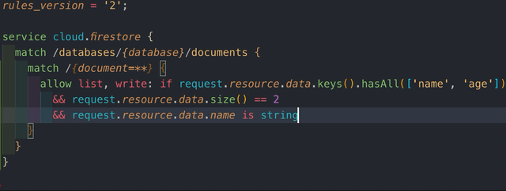
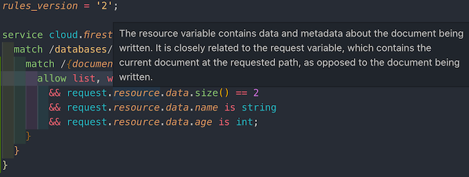
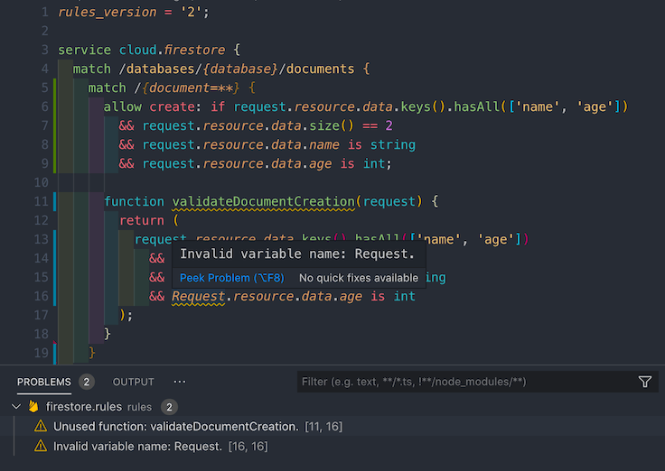

# Firestore Security Rules and Indexes

Syntax highlighting, code completions and hover help for [Firestore security rules](https://cloud.google.com/firestore/docs/reference/security/) and [index definitions](https://cloud.google.com/firestore/docs/reference/rest/v1beta1/projects.databases.indexes).

## Features

- [x] Syntax Highlighting and Code Completions

  

- [x] Hover Definitions

  

- [x] Rule validation

  
